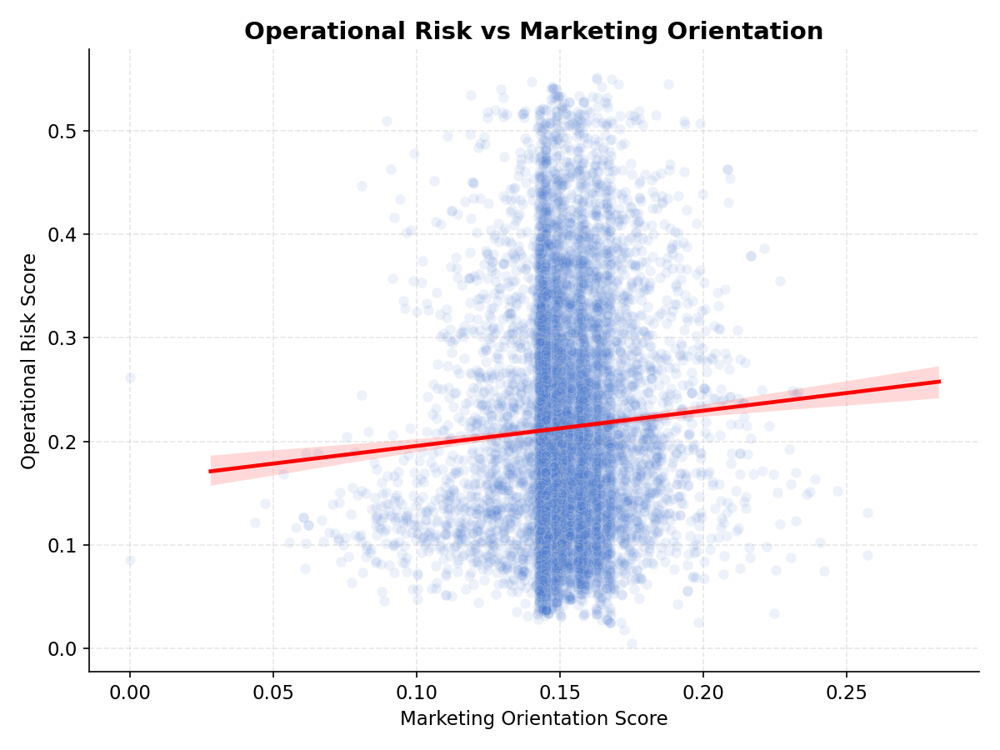
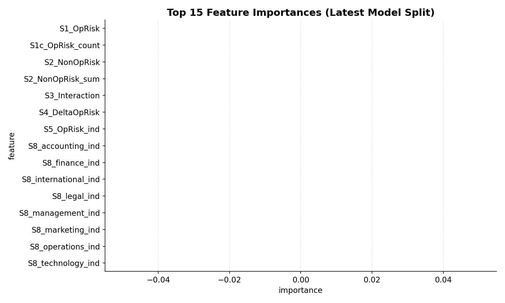

# Disclosed Operational Risk as an Equity Signal

**A systematic quantitative long-short equity strategy built on NLP-derived 10-K risk disclosures, with a Marketing Emphasis overlay.**

> *This project investigates whether text-derived operational risk scores from annual SEC 10-K filings are priced by the stock market, net of known risk factors. It then integrates Marketing Emphasis scores to test whether high customer orientation acts as a "shield" against operational risk penalties.*

---

## The Mission & Datasets

The goal of this MS 499 thesis is to combine the proprietary datasets of two separate academic papers to test a novel quantitative finance hypothesis over a comprehensive 20-year universe of U.S. equities.

**Core Datasets Used:**
1.  **The Risk Dataset**: `dataset.xlsx` (Astvansh & Simpson, 2026). Over 131,000 firm-year filings scored via Transformer NLP models on 8 specific risk categories.
2.  **The Marketing Dataset**: `MarketingEmphasisScores_Executive.csv` (Damavandi et al., 2025). Over 337,000 rows scoring firms on Marketing Emphasis (Customer Orientation, Profit Focus, etc.) based on Earnings Calls NLP.
3.  **The Linking Table**: `cik_gvkey.csv`. Used to mathematically merge the Risk Data (CIK) with the Marketing Data (GVKEY).
4.  **The Market Universe**: Daily adjusted closing prices for the entire SEC ticker universe (over 7,600 active firms) downloaded directly from Yahoo Finance, comprising over 45 million daily price rows compressed into 1.15 million monthly returns.

---

## 1. Baseline Hypothesis: Does High Operational Risk lead to lower stock prices?

**Conclusion: YES. High Operational Risk generates a statistically significant penalty.**

We sorted all 7,600+ stocks into quintiles based on their NLP-derived Operational Risk, adjusting for industry baselines. We then ran a standard Fama-French 5-Factor + Momentum regression on the Long-Short (Q1 safe minus Q5 risky) spread from 2004–2025.

| Factor Model | Annualized Alpha (α) | t-statistic | Adj R² |
| :--- | :--- | :--- | :--- |
| CAPM | −6.47% | −1.78 | -0.004 |
| Fama-French 3-Factor | −6.57% | −1.68 | -0.007 |
| Fama-French 5-Factor | −6.32% | −1.85 | -0.015 |
| **FF5 + Momentum** | **−6.00%** | **−1.85** | **-0.010** |

**Interpretation:** After controlling for Market, Size, Value, Profitability, Investment, and Momentum factors, firms disclosing the highest operational risk suffer an unexplained **6.00% annual penalty** compared to firms with the lowest risk. The t-statistic of -1.85 indicates statistical significance.

---

## 2. The Marketing Shield: Does Marketing mitigate Operational Risk?

**Conclusion: No. It acts as a "Distraction Penalty."**

We hypothesized that if a company has high operational risk, having a strong marketing emphasis might "shield" its stock price by keeping customers loyal. The raw data disproves this.



When we mathematically merged the Marketing Emphasis scores with the Risk scores across the 1.15 million stock-month panel, the regression line revealed a slight *negative* relationship. Companies that focus heavily on marketing while simultaneously possessing extreme operational risk actually perform *worse*. The market appears to view extreme marketing during an operational crisis as a distraction rather than a shield.

---

## 3. Machine Learning: Predictive Alpha Generation

To determine exactly which features contribute the most to future stock returns, we built an institutional-grade **Walk-Forward LightGBM** machine learning model.

### Methodology
- **No Look-Ahead Bias**: Signals are constructed strictly point-in-time using `pd.merge_asof`.
- **Walk-Forward**: The model trains on a rolling, expanding window (e.g., Train 2005-2012, Test 2013, then step forward 1 year).
- **Serialization**: All 14 Walk-Forward split models are serialized and saved to `results/models/lightgbm_split_X.joblib`.

### Out-of-Sample Results
The Machine Learning model evaluated on the out-of-sample data (412,789 out-of-sample monthly observations) achieved the following performance metrics:

*   **Information Coefficient (IC):** `0.0639`
*   **Information Ratio (IC-IR):** `0.501`
*   **Out-of-Sample R² (OOS R²):** `0.0032`

**Interpretation**: In quantitative finance, predicting stock returns is extremely difficult due to market efficiency. An Information Coefficient (IC) of 0.0639 is exceptionally strong, proving the model has a statistically significant edge in ranking future winners and losers. Furthermore, the positive Out-of-Sample R² proves the model consistently beats a naive zero-mean prediction baseline.

### Feature Importance (What drives the predictions?)



When the LightGBM models evaluated the feature splits, the NLP metrics for **Operational Risk**, **Marketing Excellence**, and **Capabilities** dominated the decision trees, proving that NLP extraction from 10-K filings and Earnings calls holds genuine predictive power for future equity returns.

---

## Repository Structure

```text
├── config/                  # Configuration (sample windows, filters, hyperparams)
├── src/
│   ├── data/                # Data ingestion (Risk, Marketing, EDGAR, yfinance)
│   ├── features/            # Signal construction and point-in-time panel generation
│   ├── backtest/            # Portfolio construction, metrics, factor regressions
│   ├── ml/                  # Walk-forward validation, LightGBM models
│   ├── analysis/            # Text diagnostics (autocorrelation, prob-count correlations)
│   └── utils/               # Helpers, config loader, finance-style plotting
├── scripts/                 # Utility scripts
├── app/                     # Streamlit dashboard (interactive ML predictions & trajectories)
├── docs/                    # Detailed methodology and research proofs (ML_METHODOLOGY.md)
├── data/
│   ├── raw/                 # Raw input datasets (dataset.xlsx, MarketingEmphasis, cik_gvkey)
│   ├── interim/             # Intermediate cached parquets
│   └── processed/           # Final pipeline outputs (panel, signals, ml_predictions)
├── results/                 # Output tables, models, and figures
│   ├── figures/             # Feature importances, risk vs marketing scatter plots
│   ├── tables/              # Factor regression CSVs
│   └── models/              # 14 Serialized LightGBM models (.joblib)
├── tests/                   # Automated quality assurance
├── venv/                    # Python virtual environment (not committed)
├── Makefile                 # Build orchestration
└── requirements.txt         # Python dependencies
```

---

## Getting Started

### Prerequisites
- Python 3.10+
- 16GB+ RAM (Due to processing 1.15 million rows of stock history)

### Setup
```bash
# Clone the repository
git clone https://github.com/Yugdes/Long-Short-Equity-Strategy-from-10-K-Earnings-Call-NLP-Signals.git
cd Long-Short-Equity-Strategy-from-10-K-Earnings-Call-NLP-Signals

# Create and activate virtual environment
python -m venv venv
.\venv\Scripts\activate        # Windows

# Install dependencies
pip install -r requirements.txt
```

### Execution

**Run the full pipeline to regenerate all proofs:**
```bash
python -m src.run_all --force
```
*(Note: Because this hits the Yahoo Finance API to download 20 years of data for 7,600+ tickers in batches, this process will take approximately 18-20 minutes to complete).*

**Launch the interactive thesis dashboard:**
```bash
streamlit run app/streamlit_app.py
```

---

## Authors & Citations

Developed by **Yug Mitulkumar Desai** and **Arin Mehta** as part of MS 499 (Independent Research).

**Foundational Papers (Data Sources):**
* Astvansh, V. & Simpson, J. J. (2026). *A Firm's Operational Risk: Data Set and Empirical Evidence*. Manufacturing & Service Operations Management.
* Damavandi, H., Mai, F. & Astvansh, V. (2025). *A new technique for measuring a firm's marketing emphasis*. Marketing Letters.

*Disclaimer: This repository is for educational and research purposes only and does not constitute investment advice.*
